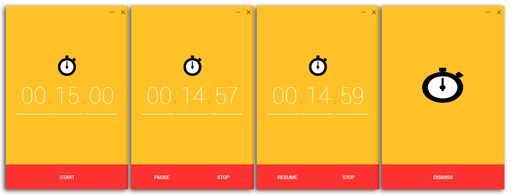

## Yosh! Timer Chrome App
Simple timer chrome app to track time of, like, everything! This is a Chrome App implementation of timer.

Install published version [here](https://goo.gl/kCssC5) (Chrome webstore)

### Screenshots

### Stacks used
This app was built using these technology stacks:
- JavaScript
- ReactJS
- Babel ES6
- Webpack
- Jest Test Engine

#### Bootstrapped with [Create React App](https://github.com/facebookincubator/create-react-app) (Ejected).
This project was bootstrapped with [Create React App](https://github.com/facebookincubator/create-react-app).
You can find the most recent version of the installation guide [here](https://github.com/facebookincubator/create-react-app/blob/master/packages/react-scripts/template/README.md).

### Something is Missing?
If you have ideas for more that should be on this app or documentation, [let us know](https://github.com/shrotavre/yosh-timer/issues) or contribute some!
